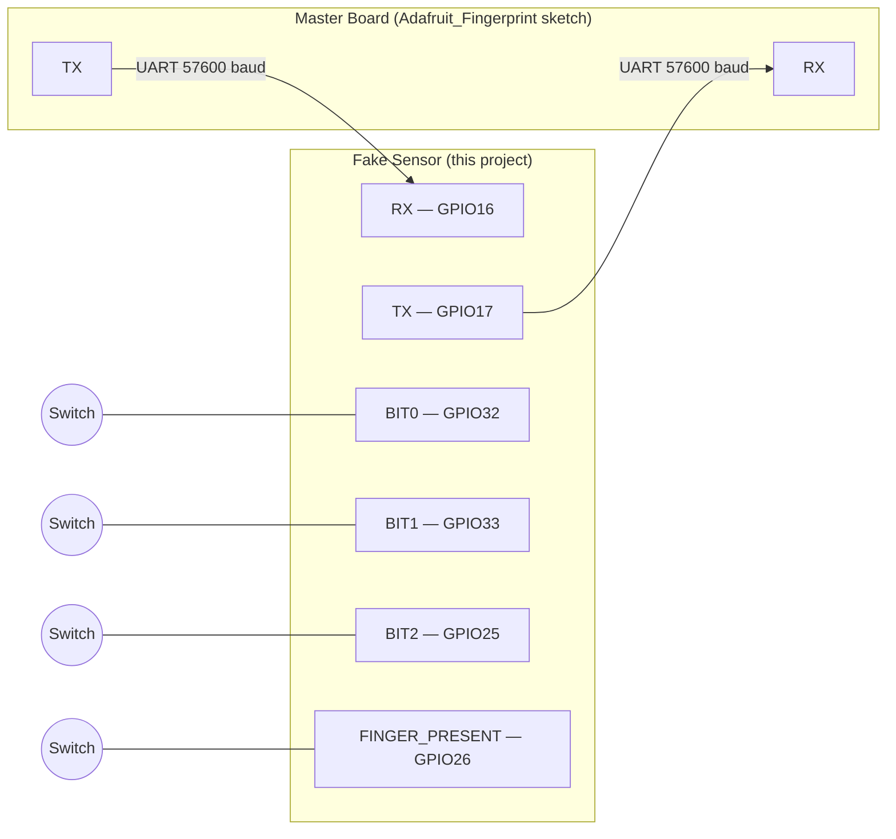
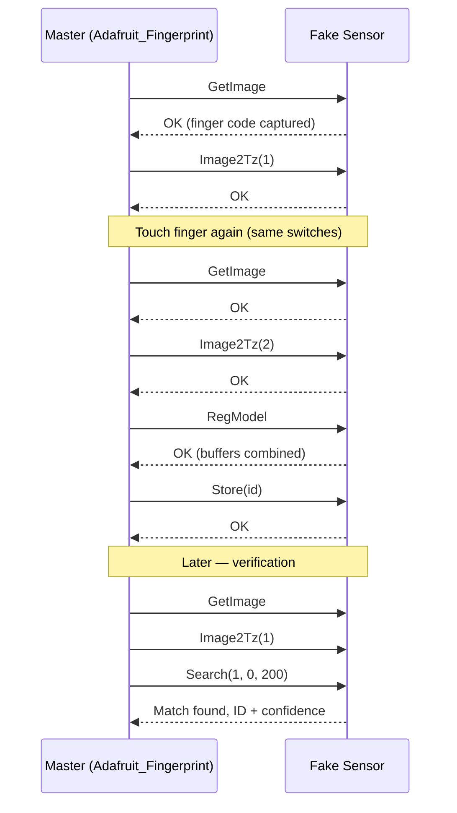

[README.md](https://github.com/user-attachments/files/32364332/README.md)
an emulated finger print senser
# 🖐️ Fake Fingerprint Sensor — ESP32 (Wokwi)

A **software emulator** of the binary UART protocol used by [`Adafruit_Fingerprint.h`](https://github.com/adafruit/Adafruit-Fingerprint-Sensor-Library) (AS608 / R30x-style optical fingerprint modules) — running entirely on an ESP32, no physical sensor required.

Flip a few switches to simulate a finger touching the sensor, and any board running a normal Adafruit fingerprint sketch will talk to it exactly as if it were real hardware: enroll, search, match, store, delete, upload/download templates — all of it.

> Built for [Wokwi](https://wokwi.com/) simulation, but runs on real ESP32 hardware too.

---

## Table of Contents

- [Why this exists](#why-this-exists)
- [Features](#features)
- [Hardware & Wiring](#hardware--wiring)
- [Getting Started](#getting-started)
- [The 4 Switches](#the-4-switches)
- [Configuration](#configuration)
- [Supported Commands](#supported-commands)
- [How the Fake Templates Work](#how-the-fake-templates-work)
- [Typical Flow](#typical-flow)
- [Limitations](#limitations)
- [Contributing](#contributing)
- [License](#license)
- [Acknowledgments](#acknowledgments)

---

## Why this exists

Developing or teaching firmware that talks to a fingerprint sensor usually means owning one. This project removes that dependency: it's a second ESP32 (or a second Wokwi instance) that speaks the **exact same binary protocol** as a real AS608/R30x module, so your actual application code — the one using `Adafruit_Fingerprint.h` — never has to know the difference.

Instead of a finger, you get **4 switches**: three pick a simulated "finger identity" (0–7) and one says whether a finger is currently on the sensor.

## Features

- 🔌 **Drop-in protocol compatibility** with `Adafruit_Fingerprint.h` (packet framing, checksum, command set, status codes)
- 🧠 **Full enrollment flow** — `GetImage` → `Image2Tz` → `RegModel` → `Store`
- 🔍 **1:1 matching and 1:N search**, including `HiSpeedSearch`
- 📤📥 **UPCHAR / DOWNCHAR** binary template transfer, chunked exactly like the real sensor (128-byte packets)
- 🔐 Optional **password protection** (`SetPassword` / `VerifyPassword`)
- 🗑️ **Delete / Empty** database management, up to 200 template slots
- 🩺 **System parameters, template count, and echo** diagnostics
- 🐛 Verbose serial debug logging (togglable)
- 🧵 Single-owner UART parser — robust against partial/garbled packets, with transfer timeouts

## Hardware & Wiring

Connect this ESP32's UART pins to a second board running a normal `Adafruit_Fingerprint` sketch — that board thinks it's talking to a genuine sensor.

| Signal              | GPIO | Notes                          |
|---------------------|:----:|---------------------------------|
| Sensor RX           | 16   | ← Master's TX                  |
| Sensor TX           | 17   | → Master's RX                  |
| Finger BIT0 (LSB)   | 32   | Switch, active LOW              |
| Finger BIT1         | 33   | Switch, active LOW              |
| Finger BIT2 (MSB)   | 25   | Switch, active LOW              |
| Finger Present      | 26   | Switch, active LOW              |

All switch pins use `INPUT_PULLUP`, so an unconnected pin reads as "off."



## Getting Started

### Option A — Wokwi (recommended)

1. Open the project in [Wokwi](https://wokwi.com/) (ESP32 board).
2. Wire a second ESP32 (running your `Adafruit_Fingerprint`-based sketch) to the pins above.
3. Toggle the switches, hit **Run**, and watch the two boards talk over serial.

### Option B — Real ESP32 hardware

1. Install the [Arduino ESP32 core](https://github.com/espressif/arduino-esp32) (or use PlatformIO with `board = esp32dev`).
2. Wire the pins as described above between the two boards.
3. Flash this sketch to the "fake sensor" board and your normal fingerprint sketch to the "master" board.
4. Open the Serial Monitor at `115200` baud on the fake sensor board to see debug output.

```bash
# PlatformIO
pio run -t upload
pio device monitor -b 115200
```

## The 4 Switches

| Switch            | Purpose                                                                 |
|--------------------|--------------------------------------------------------------------------|
| BIT0, BIT1, BIT2   | Together form a 3-bit **finger identity** (0–7) — think of it as "which finger" |
| FINGER_PRESENT     | Simulates a finger currently touching the sensor                        |

When the master calls `getImage()`, the sensor checks `FINGER_PRESENT`. If it's on, the 3-bit code from BIT0–BIT2 becomes that scan's "fingerprint." Two scans are considered the *same* finger only if the 3-bit code matches — this is what drives enrollment matching and searches.

## Configuration

All of these live at the top of the `.cpp` file:

| Constant                | Default      | Description                                                        |
|--------------------------|:------------:|----------------------------------------------------------------------|
| `SENSOR_BAUD`            | `57600`      | UART baud rate (matches real AS608 default)                        |
| `DEBUG`                  | `true`       | Verbose serial logging                                             |
| `ENFORCE_PASSWORD`       | `false`      | Require `VerifyPassword` before other commands                     |
| `MAX_TEMPLATES`          | `200`        | Size of the fake fingerprint database                              |
| `DEVICE_ADDRESS`         | `0xFFFFFFFF` | Standard broadcast address used by most AS608/R30x modules         |
| `MAX_PACKET_LENGTH`      | `256`        | Max accepted payload length                                        |
| `CHUNK_SIZE`             | `128`        | Bytes per UPCHAR/DOWNCHAR data packet                               |
| `DOWNLOAD_TOTAL_TIMEOUT_MS` | `5000`   | Abort a DOWNCHAR transfer after this long                          |
| `DOWNLOAD_PACKET_TIMEOUT_MS` | `2000`  | Abort if no new chunk arrives within this window                   |

## Supported Commands

| Command            | Opcode | Description                                    |
|---------------------|:------:|--------------------------------------------------|
| `GetImage`          | `0x01` | Capture the "current" finger                    |
| `Image2Tz`          | `0x02` | Convert capture into CharBuffer 1 or 2           |
| `Match`             | `0x03` | 1:1 compare CharBuffer1 vs CharBuffer2           |
| `Search`            | `0x04` | 1:N search across the database                   |
| `RegModel`          | `0x05` | Combine buffers 1 & 2 into a model               |
| `Store`             | `0x06` | Save the model to a template ID                  |
| `LoadChar`          | `0x07` | Load a stored template into a buffer             |
| `UpChar`            | `0x08` | Export a template (256B from RAM, or 512B from Flash) |
| `DownChar`          | `0x09` | Import a 256-byte template into a buffer         |
| `Delete`            | `0x0C` | Delete a range of template IDs                   |
| `Empty`             | `0x0D` | Wipe the whole database                          |
| `ReadSysParam`      | `0x0F` | Return system parameters                         |
| `SetPassword`       | `0x12` | Set the device password                          |
| `VerifyPassword`    | `0x13` | Authenticate against the device password         |
| `HiSpeedSearch`     | `0x1B` | Faster search variant                            |
| `TemplateCount`     | `0x1D` | Count of stored templates                         |
| `AuraLedConfig`     | `0x35` | LED control (Adafruit extension) — ACKs only     |
| `GetEcho` *(custom)*| `0x40` | Non-standard echo/diagnostic test command        |

Full AS608/R30x-style packet framing (`0xEF01` header, device address, type, length, checksum) is implemented — see the in-code comments for the exact byte layout.

## How the Fake Templates Work

Since there's no real fingerprint feature data, this project uses a **deterministic placeholder format** so transfers can be verified byte-for-byte:

- A "template" is **256 bytes**: `[fingerCode, 0x00, 0x00, ..., 0x00]` — only the first byte carries meaning (the 0–7 finger identity), the rest is padding.
- A **512-byte** UPCHAR export (used for enrolled Flash templates) is just that 256-byte template duplicated twice.
- `DownChar` only accepts data in this exact shape — it validates the padding is all zero and the code is ≤ `0x07`. This means DownChar is designed for **simulator-to-simulator** transfers (e.g. piping a template exported by one fake sensor into another), not arbitrary real fingerprint data.

## Typical Flow



## Limitations

- This is a **behavioral simulator**, not a cryptographic or biometric one — the "fingerprint" is a 3-bit switch value, not real feature data.
- `LoadChar`/`UpChar` accept buffer slot `1` or `2`, though the stock Adafruit library only ever requests slot `1` — harmless, just more permissive than strictly necessary.
- `HiSpeedSearch` is a direct alias of `Search` (no actual speed optimization, since there's nothing to optimize in a fake).
- `GetEcho` (`0x40`) is a project-specific diagnostic command, not part of the official AS608 protocol.

## Contributing

Issues and PRs welcome — especially additional command coverage, image-buffer (UpImage/DownImage) support, or a companion "real sensor passthrough" mode.

## License

MIT — see [`LICENSE`](LICENSE) *(add a license file matching your repo's actual terms)*.

## Acknowledgments

- [Adafruit Fingerprint Sensor Library](https://github.com/adafruit/Adafruit-Fingerprint-Sensor-Library) — the protocol this project emulates
- [Wokwi](https://wokwi.com/) — ESP32 simulation platform
